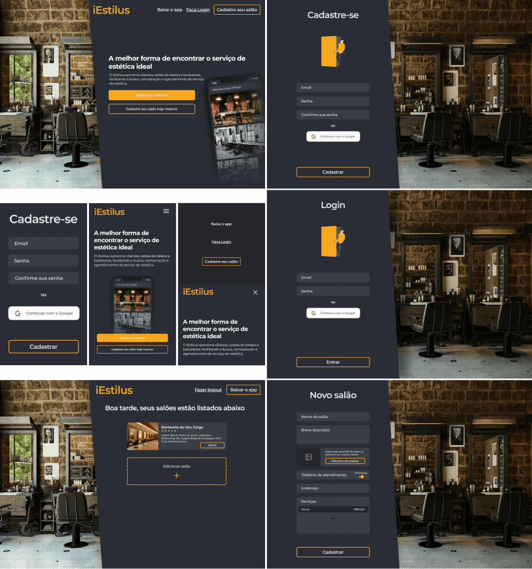

<h1 align="center">
    
  <br>
    
    
    
    
    <a href="https://github.com/RenanArques/iestilus/commits/master">
      
    </a>
    <a href="https://www.codacy.com/manual/RenanArques/iEstilus?utm_source=github.com&amp;utm_medium=referral&amp;utm_content=RenanArques/iEstilus&amp;utm_campaign=Badge_Grade_Dashboard">
      
    </a>
    <a href="https://github.com/RenanArques/iestilus/blob/master/LICENSE">
      
    </a>
    <a href="https://app.netlify.com/sites/iestilus/deploys">
      
    </a>
</h1>

<p align="center">:iphone: App para busca e agendamento de serviços de estética</p>


<p align="center">
 <a href="#computer-executar">Executar</a> •
 <a href="#art-design">Design</a> •
 <a href="#book-tecnologias">Tecnologias</a> •
 <a href="#rocket-deploy">Deploy</a> •
 <a href="#memo-licença">Licença</a>
</p>

## :computer: Executar

Antes de executar o projeto localmente é preciso instalar algumas ferramentas de desenvolvimento:

- [Git](https://git-scm.com/downloads)
- [Yarn](https://classic.yarnpkg.com/pt-BR/docs/install)
- [Node.js](https://nodejs.org/en/) (é instalado automaticamente pelo [Yarn](https://classic.yarnpkg.com/pt-BR/docs/install))

Após a instalação colone esse repositório executando:

```sh
$ git clone https://github.com/RenanArques/iEstilus.git
```

### API

Para executar a API é preciso ter o [PostgreSQL](https://www.postgresql.org/) com o [PostGIS](https://postgis.net/) instalados.

No diretório `backend` execute os comandos:

```sh
# Instale os pacotes necessários
$ yarn

# Execute a API
$ yarn start

# Ou execute em modo de desenvolvimento assim a cada alteração a API é atualizada
$ yarn dev
```

### Aplicação Web

No diretório `web` execute os comandos:

```sh
# Instale os pacotes necessários
$ yarn

# Execute a aplicação web
$ yarn start
```

### Aplicação Mobile

O [Expo CLI](https://docs.expo.io/workflow/expo-cli/) é necessário para executar a aplicação mobile para instalar execute o comando:

```sh
$ npm install --global expo-cli
```

No diretório `mobile` execute os comandos:

```sh
# Instale os pacotes necessários
$ yarn

# Execute a aplicação mobile
$ yarn start
```

Para executar a aplicação mobile no navegador execute o comando:

```sh
$ yarn web
```

## :art: Design

Todo design da aplicação foi desenvolvido no Figma e pode ser acessado através [desse link](https://www.figma.com/file/EEzMwTK8iCIFPdAta2XMVm/iEstilus?node-id=652%3A1).

### Web



### Mobile


## :book: Tecnologias

As principais ferramentas utilizadas no desenvolvimento do projeto

### API

- [Node.js](https://nodejs.org/en/)
- [Express](https://expressjs.com/)
- [Knex.js](https://knexjs.org/)
- [Firebase Authentication](https://firebase.google.com/docs/auth/)
- [Firebase Cloud Storage](https://firebase.google.com/docs/storage)

#### Banco de Dados

- [PostgreSQL](https://www.postgresql.org/)
- [PostGIS](https://postgis.net/)

### Aplicação Web

- [TypeScript](https://www.typescriptlang.org/)
- [React](https://reactjs.org)
- [Create React App](https://github.com/facebook/create-react-app)
- [React Router](https://github.com/ReactTraining/react-router)
- [React Transition Group](https://reactcommunity.org/react-transition-group/)
- [Axios](https://github.com/axios/axios)

### Aplicação Mobile

- [React Native](https://facebook.github.io/react-native/)
- [Expo](https://expo.io/)
- [React Navigation](https://reactnavigation.org/)
- [React Native Shared Element](https://github.com/IjzerenHein/react-native-shared-element)
- [React Native Reanimated](https://github.com/software-mansion/react-native-reanimated)
- [React Native Web](https://github.com/necolas/react-native-web)
- [Axios](https://github.com/axios/axios)

## :rocket: Deploy

### API

A [API](https://iestilus.herokuapp.com) e banco de dados do projeto está hospedada no [Heroku](https://www.heroku.com/) com o endereço https://iestilus.herokuapp.com, usa o diretório `backend` com deploys automáticos configurados.

### Aplicação Web

A [aplicação web](https://iestilus.com) foi hospedada no [Netlify](https://www.netlify.com/) com o endereço https://iestilus.com, usa o diretório `web` com build e deploys automáticos habilitados e [histórico](https://app.netlify.com/sites/iestilus/deploys) disponível.

### Aplicação Mobile

A [aplicação mobile](https://app.iestilus.com) graças ao [React Native Web](https://github.com/necolas/react-native-web) pode ser utilizada com algumas limitações na web também foi hospedada no [Netlify](https://www.netlify.com/) com o endereço https://app.iestilus.com, usa o diretório `mobile` com a build e deploys automáticos habilitados e [histórico](https://app.netlify.com/sites/iestilus-app/deploys) disponível.

## :memo: Licença

Esse projeto está sob a licença MIT. Veja o arquivo [LICENSE](LICENSE.md) para mais detalhes.
